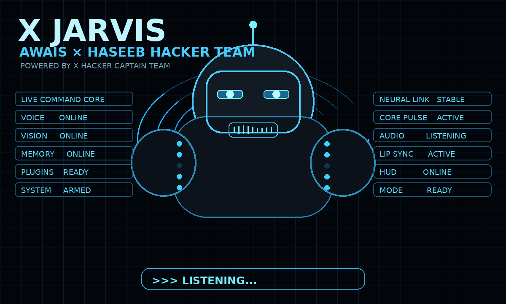

<div align="center">


# ⚙️ X JARVIS

### `THE PERSONAL AI COMMAND CORE`

**AWAIS × HASEEB HACKER TEAM**
`POWERED BY X HACKER CAPTAIN TEAM`

[](https://www.python.org/)
[](#-platform-support)
[](#-platform-support)
[](#-platform-support)
[](https://ai.google.dev/)
[](https://creativecommons.org/licenses/by-nc/4.0/)

[](https://github.com/awaishacker1/X-Jarvis/stargazers)
[](https://github.com/awaishacker1/X-Jarvis/network/members)
[](https://github.com/awaishacker1/X-Jarvis/commits/main)

<br>


<i>Your own AI system — running locally, watching, listening, remembering, acting.</i>

<br><br>



<i>Live Command Core — Voice · Vision · Memory · Automation, all in real time.</i>

<br><br>

<a href="#-quick-start"></a>
<a href="#-features"></a>
<a href="#-commands"></a>
<a href="#-architecture"></a>
<a href="#-support"></a>

</div>

---

## 🛰️ LIVE COMMAND CORE

```text
╔══════════════════════════════════════════════════════════════════════════╗
║                             X   J A R V I S                              ║
║                        AWAIS × HASEEB HACKER TEAM                        ║
║                          X HACKER CAPTAIN TEAM                           ║
╠══════════════════════════════════════════════════════════════════════════╣
║  ● VOICE         ONLINE         ● VISION        ONLINE                   ║
║  ● MEMORY        ONLINE         ● PLUGINS       READY                    ║
║  ● SYSTEM        READY          ● OFFLINE STT   READY                    ║
║  ● HUD           ACTIVE         ● DASHBOARD     READY                    ║
╠══════════════════════════════════════════════════════════════════════════╣
║                        >>> READY FOR COMMAND <<<                         ║
╚══════════════════════════════════════════════════════════════════════════╝
```

<br>

## ⚡ FEATURES

| Core | Capability | State |
|---|---|:---:|
| 🤖 **Heavy HUD** | Animated futuristic command interface | `ACTIVE` |
| 🎙️ **Live Voice** | Real-time conversational voice | `ONLINE` |
| 👁️ **Vision** | Screen + webcam awareness | `READY` |
| 🧠 **Memory** | Persistent local facts/preferences | `ONLINE` |
| ⚙️ **System Control** | Apps, volume, lock, restart, shutdown | `READY` |
| 🧩 **Plugins** | Drop-in Python skills | `READY` |
| 🎙️ **Offline STT** | Whisper / Vosk | `READY` |
| 📱 **Dashboard** | Remote control interface | `READY` |
| 🔐 **Confirmation** | Human confirmation for destructive actions | `ENABLED` |

<br>

## 🎙️ COMMANDS

<table>
<tr><td valign="top" width="50%">

**SYSTEM**
```text
Open Chrome
Set volume to 50%
Lock the screen
Restart the computer
Shutdown the computer
Open system settings
```

**FILES**
```text
Organize my desktop
Find the PDF on my desktop
Summarize the PDF on my desktop
```

**WEB / BROWSER**
```text
Search for the latest AI news
What's the weather in Lahore?
Open youtube.com
Search YouTube for lofi music
```

</td><td valign="top" width="50%">

**PRODUCTIVITY**
```text
Add a todo: buy milk
Save a note: meeting at 3pm
Show my todos
```

**VISION / CODE / MEMORY**
```text
Look at my screen
What's on my webcam?
Review this code
Write a Python function that sorts a list
Remember that my favorite editor is VS Code
```

**VOICE CONTROL**
```text
Hey Jarvis
```
```text
CTRL + SPACE
```

</td></tr>
</table>

> ⚠️ Restart and shutdown require explicit confirmation in the HUD.

<br>

## 🧠 ARCHITECTURE

```text
USER
 │
 ├── 🎙 VOICE / KEYBOARD
 │
 ▼
INPUT + STT
 │
 ▼
X JARVIS ROUTER
 │
 ├──── SYSTEM
 ├──── WEB
 ├──── VISION
 ├──── MEMORY
 ├──── PRODUCTIVITY
 └──── PLUGINS
 │
 ▼
ACTION ENGINE
 │
 ├── TTS
 ├── HUD
 └── RESPONSE
```

<br>

## 🚀 QUICK START

> 👶 **New to Python / Git?** Beginner-friendly — just follow these steps top to bottom, in order. Nothing here needs prior coding experience.

### ✅ Step 0 — One-time prerequisites (skip if already installed)

| Tool | Why you need it | Get it |
|---|---|---|
| **Python 3.11 – 3.13** | Runs X Jarvis | [python.org/downloads](https://www.python.org/downloads/) — ✅ tick **"Add python.exe to PATH"** during install |
| **Git** | Downloads (clones) this repo | [git-scm.com/downloads](https://git-scm.com/downloads) |

### 🪟 Windows

```powershell
git clone https://github.com/awaishacker1/X-Jarvis.git
cd X-Jarvis
python -m venv .venv
.venv\Scripts\Activate.ps1
python -m pip install --upgrade pip
python setup.py
python main.py
```

### 🍎 macOS  /  🐧 Linux

```bash
git clone https://github.com/awaishacker1/X-Jarvis.git
cd X-Jarvis
python3 -m venv .venv
source .venv/bin/activate
python -m pip install --upgrade pip
python setup.py
python main.py
```

`setup.py` installs every package X Jarvis needs (from `requirements.txt`) and prepares your first-run config — you only need to do this once per machine.

<br>

### 🔁 Already installed before? Re-run / update

If you've set X Jarvis up before and are just launching it again, or pulling a newer version from GitHub, use this:

```bash
cd X-Jarvis
git pull
.venv\Scripts\Activate.ps1        # Windows
# source .venv/bin/activate       # macOS / Linux — use this line instead
python -m pip install -r requirements.txt --upgrade
python main.py
```

This re-installs / updates **every required package** in one command — nothing extra to remember, nothing left missing.

<br>

### 🧩 Manual dependencies (if you skip `setup.py`)

```bash
python -m pip install -r requirements.txt
python -m playwright install chromium firefox
```

<br>

## 🔑 GEMINI SETUP

X Jarvis's brain runs on Google's Gemini Live API — and it's free to get a key.

1. Open **[Google AI Studio → Get API Key](https://aistudio.google.com/app/apikey)**
2. Sign in with any Google account and click **Create API key**
3. Copy the key
4. Run `python main.py` — X Jarvis will ask for it on first launch and save it locally

> 🔒 Your key never leaves your computer, and `.gitignore` already keeps it out of Git — see [SECURITY](#-security) below.

<br>

## 🖥️ PLATFORM SUPPORT

```text
Windows 10 / 11    ✓
macOS              ✓
Linux              ✓
Python 3.11–3.13   ✓
GPU                Optional
Microphone         Required for voice
Internet           Required for live cloud voice
```

<br>

## 📁 PROJECT STRUCTURE

```text
X-Jarvis/
├── main.py
├── ui.py
├── setup.py
├── requirements.txt
├── README.md
├── LICENSE
├── actions/
├── core/
├── memory/
├── plugins/
├── dashboard/
├── config/
└── assets/
    ├── x-jarvis-hero.png        # Static hero — shown first
    └── x-jarvis-heavy-loop.gif  # Animated HUD — shown second
```

<br>

## 🔐 SECURITY

```text
✓ API keys excluded from Git (.gitignore already set up)
✓ Runtime memory excluded from Git
✓ Destructive actions require confirmation
✓ Review third-party plugins before installing
✓ Do not expose remote dashboards without authentication
✓ Use TLS for remote deployments
```

A ready-to-use `.gitignore` already ships with this repo — you don't need to create or edit one. It keeps your API key, TLS certs, linked WhatsApp session, OAuth tokens, and personal memory data out of Git automatically.

<br>

## 🧪 TROUBLESHOOTING

| Problem | Fix |
|---|---|
| `'python' is not recognized` | Reinstall Python and tick **"Add to PATH"** |
| `ModuleNotFoundError: No module named 'xxx'` | Activate `.venv`, then run `python -m pip install -r requirements.txt --upgrade` |
| Playwright error | `python -m playwright install chromium firefox` |
| No microphone detected | Check your OS's microphone permissions for Python/Terminal |
| Voice doesn't speak back | Re-run `python -m pip install -r requirements.txt --upgrade` (installs the TTS engine) |
| Shutdown/restart not working | Open the HUD and press **CONFIRM** |
| Still stuck? | Open an issue on GitHub or ping the team — see [SUPPORT](#-support) |

<br>

## 🛣️ ROADMAP

```text
[✓] Voice
[✓] Vision foundation
[✓] Memory
[✓] Plugin architecture
[✓] Desktop HUD
[✓] System actions
[✓] Offline STT

[ ] Expanded local AI
[ ] Advanced avatar rendering
[ ] More offline capabilities
[ ] Expanded mobile dashboard
[ ] More OS integrations
```

<br>

## 💬 SUPPORT

<div align="center">

[](https://whatsapp.com/channel/0029VbBzlMlIt5rzSeMBE922)
[](https://chat.whatsapp.com/EPOI1v4hJ6b822unjnlujz)
[](https://t.me/awaishacker1)
[](https://wa.me/923295533119)

</div>

<br>

## 👥 TEAM

<div align="center">

```text
╔════════════════════════════════════════════════════════════╗
║                                                            ║
║                 AWAIS × HASEEB HACKER TEAM                 ║
║                                                            ║
║              POWERED BY X HACKER CAPTAIN TEAM              ║
║                                                            ║
║                          X JARVIS                          ║
║                                                            ║
╚════════════════════════════════════════════════════════════╝
```

</div>

<br>

## ⚠️ RESPONSIBLE USE

X JARVIS is intended for authorized personal automation, productivity, accessibility, development, and system administration. Do not use system, browser, file, webcam, microphone, or remote-control capabilities against systems or accounts without authorization.

<br>

## 📜 LICENSE

Personal and non-commercial use only.

**CC BY-NC 4.0** — [creativecommons.org/licenses/by-nc/4.0](https://creativecommons.org/licenses/by-nc/4.0/)

---

<div align="center">

# ⚙️ X JARVIS

```text
HEAR → SEE → THINK → REMEMBER → SPEAK → ACT
```

### `AWAIS × HASEEB HACKER TEAM`

**POWERED BY X HACKER CAPTAIN TEAM**

<br>


</div>
